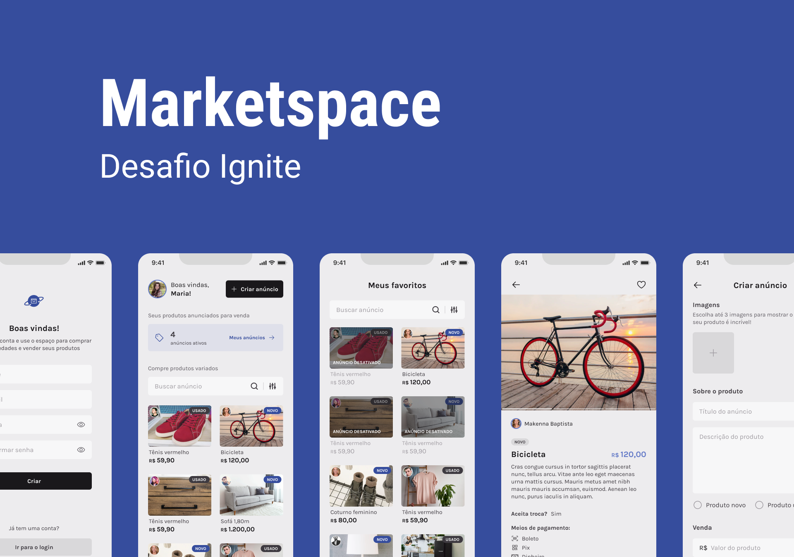

# Marketspace

# Rocketseat Ignite React Native - Desafio 3

Aplicação de anúncios de produtos estilo OLX.

## Requerimentos

- [Node](https://nodejs.org)
- [yarn](https://yarnpkg.com/getting-started/install) ou [npm](https://www.npmjs.com)
- Requerimentos do [React Native](https://reactnative.dev)

## Tech Stack

- [React](https://reactjs.org)
- [React Native](https://reactnative.dev)
- [TypeScript](https://www.typescriptlang.org)
- [Javascript](https://www.javascript.com/)
- [Native Base](https://nativebase.io/)
- [Expo](https://expo.dev)
- [React Navigation](https://reactnavigation.org)
- [React Hook Form](https://react-hook-form.com)

## Funcionalidades

- Login e cadastro de usuários
- Gerenciamento de produtos
- Listagem de produtos com busca e filtros
- Envio de múltiplas imagens

## Conceitos aplicados

- Estados
- Context API
- Consumo de API
- Manipulação de imagens
- Formulários
- Navegação

## Layout Base

[Figma](https://www.figma.com/file/CIvhyoji2zASYQKFGeWUEn/Marketspace/duplicate)
